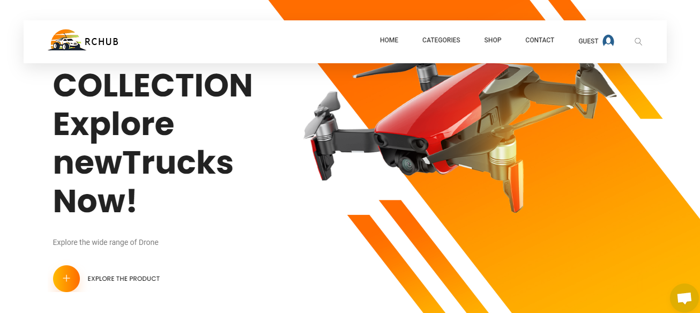

# Rc_hub_e_comerse E-commerce Website

## Description
This is a Node.js Express project for an e-commerce website specializing in the sale of drones. The project includes both an admin panel and a user panel, allowing administrators to manage products, orders, and users, while users can browse products, make purchases, and manage their accounts.

## LiveLink User: https://rc-hub-ecomerse-kmb2.onrender.com/

## Credentials
### User
- Email: user@gmail.com
- Password: 1234

### Admin
- Email: admin@gmail.com
- Password: 1234

## Screenshots

## LiveLink Admin: https://rc-hub-ecomerse-kmb2.onrender.com/

## Features
- User authentication and authorization
- Product browsing and searching
- Cart functionality for adding and removing products
- Checkout process for placing orders
- Admin panel for managing products, orders, and users
- Responsive design for mobile and desktop devices

## Technologies Used
- Node.js
- Express.js
- MongoDB (or your preferred database)
- HTML/CSS (or a front-end framework like React, Angular, or Vue.js)
- Bootstrap (or another CSS framework for styling)

## Installation
1. Clone the repository: `git clone <repository-url>`
2. Navigate to the project directory: `cd drone-e-commerce`
3. Install dependencies: `npm install ` / `npm install nodemon -g`
4. Set up your environment variables (e.g., database connection string, session secret)
5. Start the server: `npm start`

## Usage
- Visit the website and explore the available products
- Sign up for a user account or log in if you already have one
- Add products to your cart and proceed to checkout to place an order
- Log in to the admin panel to manage products, orders, and users

## Contributing
Contributions are welcome! If you'd like to contribute to this project, please follow these steps:
1. Fork the repository
2. Create a new branch: `git checkout -b feature-name`
3. Make your changes and commit them: `git commit -am 'Add new feature'`
4. Push to the branch: `git push origin feature-name`
5. Submit a pull request

## License
[MIT License](LICENSE)

## Acknowledgements
- [Express.js](https://expressjs.com/)
- [MongoDB](https://www.mongodb.com/)
- [Bootstrap](https://getbootstrap.com/)
